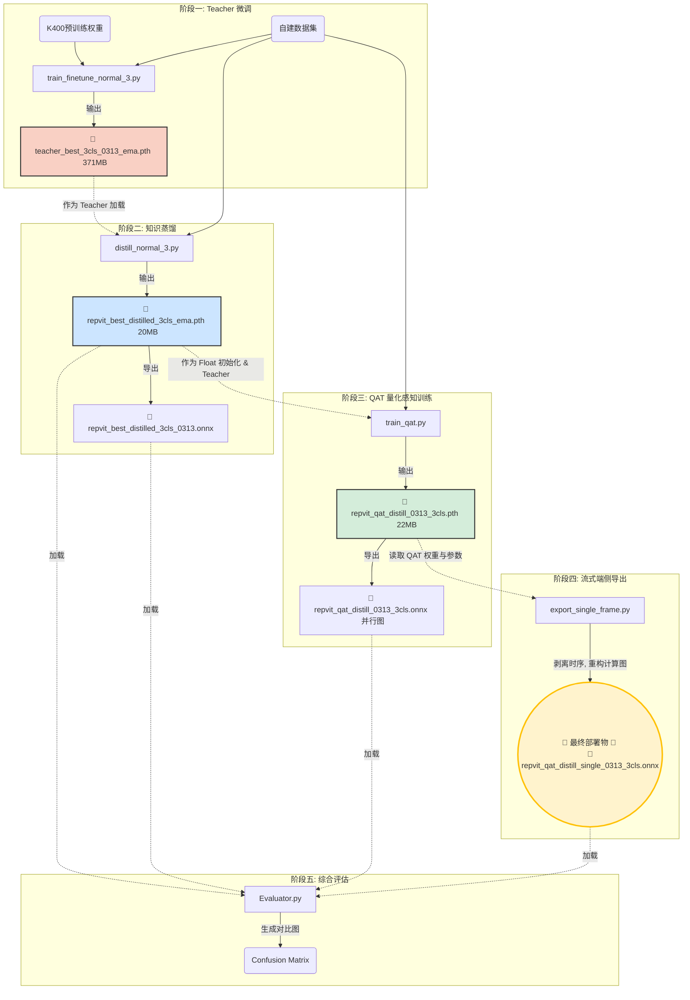

## **模型训练与部署产物全流程链路 (Pipeline Artifacts Workflow)**

在本项目完整的 “微调 $\rightarrow$ 蒸馏 $\rightarrow$ 量化 $\rightarrow$ 导出” 工业级流水线中，各个 Python 脚本通过特定的权重文件（`.pth` / `.onnx`）相互连接。上一个脚本的产出，严格作为下一个脚本的输入。

结合项目产出目录（`outputs/`），以下是以normal三分类脚本为例，各脚本与生成文件之间的流转链路详解：

## **🔗 阶段一：大模型微调 (Teacher Fine-tuning)**

- **执行脚本**：`train_finetune_normal_3.py` (或 `train_finetune_ab_5.py`)
- **输入**：Kinetics-400 预训练权重、自建宠物行为数据集。
- **产出文件**：📄 `teacher_best_3cls_0313_ema.pth` **(371,301 KB)**
- **文件说明**：这是基于 Swin3D-B 训练出的 Teacher 模型 EMA 权重。体积庞大（约 371MB），提取时空特征能力极强，但无法在端侧实时运行。它将作为下一阶段的“知识源泉”。

## **🔗 阶段二：知识蒸馏 (Knowledge Distillation)**

- **执行脚本**：`distill_normal_3.py` (或 `distill_abnormal_5.py`)
- **依赖输入**：阶段一产出的 📄 `teacher_best_3cls_0313_ema.pth`。
- **产出文件**：
  - 📄 `repvit_best_distilled_3cls_ema.pth` **(20,806 KB)**
  - 📄 `repvit_best_distilled_3cls_0313.onnx` **(20,375 KB)** *(由基础导出脚本生成)*
- **文件说明**：这是轻量级 Student 模型 (RepViT-GRU) 的 FP32（单精度浮点）最佳权重。经过蒸馏，参数量大幅压缩至约 20MB。该 `.pth` 文件具备极高的准确率，是后续量化阶段的基准底座。

## **🔗 阶段三：量化感知训练 (Quantization-Aware Training, QAT)**

- **执行脚本**：`train_qat.py`
- **依赖输入**：阶段二产出的 📄 `repvit_best_distilled_3cls_ema.pth`。
- **脚本动作**：读取上述 FP32 权重，一边作为自身 Float 初始化的起点，一边作为 Teacher 进行同构蒸馏（防止量化掉点）。
- **产出文件**：
  - 📄 `repvit_qat_distill_0313_3cls.pth` **(22,232 KB)**
  - 📄 `repvit_qat_distill_0313_3cls.onnx` **(25,166 KB)**
- **文件说明**：这是插入了伪量化节点 (FakeQuantize) 的 QAT 权重。注意，体积比阶段二略大，是因为内部包含了 Observer（观察器）统计的 Min/Max 参数。此处的 `.onnx` 是基于 `Batch*Time` 并行维度导出的，主要用于验证精度，但不适合摄像头单帧推流。

## **🔗 阶段四：流式单帧格式重构与导出 (Streaming Export)**

- **执行脚本**：`export_single_frame.py`
- **依赖输入**：阶段三产出的 📄 `repvit_qat_distill_0313_3cls.pth`。
- **脚本动作**：将 QAT 权重无缝挂载到单帧流式包装器（`RepViT_QAT_SingleFrame_Export_Wrapper`）中，剥离时间序列维度，暴露出隐状态（Hidden State）接口。
- **产出文件**：📄 `repvit_qat_distill_single_0313_3cls.onnx` **(25,163 KB)**
- **文件说明**：**🌟 这是整个 AI 训练流水线交付给 C++/C# 或 Web 部署后端的最终产物 🌟**。它支持 `一帧图片 + 前一帧隐向量` 的 $O(1)$ 复杂度循环推理，完美契合 `go2rtc` 传来的实时视频流格式。

## **🔗 阶段五：多端对齐评估 (Evaluation)**

- **执行脚本**：`Evaluator.py`
- **依赖输入**：同时读取上述生成的各类 `.pth` 与 `.onnx` 文件。
- **脚本动作**：在一套统一的测试集下，横向对比 FP32、QAT、动态量化等各个版本的预测表现，生成混淆矩阵对比图，以验证量化导出过程中是否发生精度崩塌。

------

## **模型训练全流程示意图 (Model Flow Diagram)**

